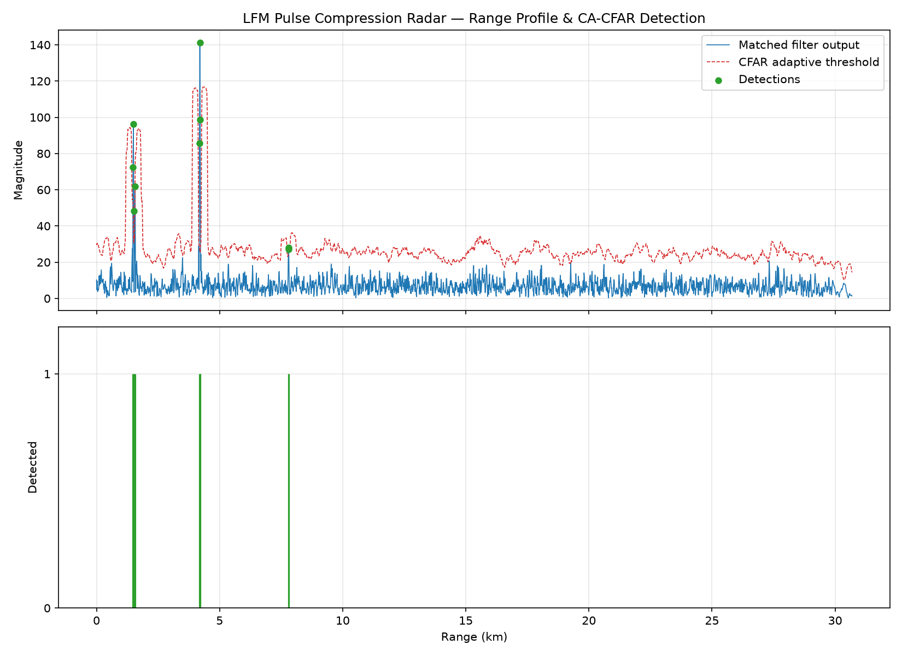

# LFM Pulse Compression Radar Simulation with CFAR Target Detection

C simulation + Python visualization pipeline for a linear-frequency-modulated
(LFM/chirp) pulse-compression radar with adaptive CA-CFAR target detection.



*Range profile after matched filtering (blue), the adaptive CA-CFAR threshold
(red dashed), and detections (green) for four synthetic targets — including
a closely-spaced pair (~1.5 km) and a weak target (~7.8 km).*

## Build & run

```bash
gcc -O2 -Wall -o lfm_radar lfm_radar.c -lm
./lfm_radar > radar_output.csv
python3 visualize.py radar_output.csv
```

Requires `matplotlib` (`pip install matplotlib`).

Note: noise is randomized per run (`srand(time(NULL))`), so exact detection
counts/positions near the weak target may vary slightly run to run. For a
reproducible result to include in a report, change that line in `main()` to
a fixed seed, e.g. `srand(42);`.

## What it does

1. **Chirp generation** — builds an LFM pulse `s(t) = exp(jπKt²)`, `K = B/T`,
   over the configured pulse width `T` and bandwidth `B`.
2. **Scene simulation** — places synthetic targets at chosen ranges/amplitudes,
   delays each target's chirp copy by `2R/c` samples, sums them, and adds
   complex Gaussian noise.
3. **Matched filtering (pulse compression)** — convolves the received signal
   with the time-reversed conjugate of the chirp. This is the classic
   matched filter, and it's what turns a long, low-power chirp into a narrow,
   high-SNR peak at each target's range. Range resolution after compression
   is `c / (2B)`.
4. **CA-CFAR detection** — Cell-Averaging Constant False Alarm Rate: for each
   range bin, average the power in surrounding training cells (skipping guard
   cells adjacent to the cell under test) to get a local noise estimate, then
   set the detection threshold to `α × noise_estimate`, where `α` is derived
   from the desired probability of false alarm (`Pfa`). This keeps the false
   alarm rate constant even as the noise floor varies across range — a fixed
   threshold would either miss weak targets or flood you with false alarms.
5. **CSV output → Python plot** — `visualize.py` plots the matched-filter
   range profile, the CFAR threshold curve, and marks detections.

## A subtlety worth knowing (and worth mentioning if asked about the project)

The matched filter here is implemented as a **full convolution**
(`y[k] = Σ rx[m]·h[k−m]`), which has length `N + Np − 1` and introduces a
group delay of `Np − 1` samples — a target's compressed peak lands at
`delay + (Np − 1)`, not at `delay`. The code corrects for this before
converting bins to range. This is a common gotcha in matched-filter radar
sims and worth understanding rather than just copying: if you switch to an
FFT-based (frequency-domain) matched filter, the delay bookkeeping changes
again depending on zero-padding and circular vs. linear convolution.

## Parameters you can tune (`lfm_radar.c`, `main()`)

| Parameter | Meaning | Current value |
|---|---|---|
| `fs` | Sample rate | 10 MHz |
| `pulse_width` | Chirp duration `T` | 10 µs |
| `bandwidth` | Chirp bandwidth `B` | 5 MHz → range resolution ≈ 30 m |
| `n_samples` | Receive window length | 2048 |
| `noise_power` | Noise variance | 0.6 |
| `targets[]` | Range (m) / amplitude pairs | 4 targets incl. a close pair and a weak one |
| CFAR `guard`, `train`, `pfa` | Detector tuning | 4, 16, 1e-4 |

## Ideas to extend it (good for a report / demo)

- **FFT-based matched filtering** — replace the O(N·Np) direct convolution
  with FFT-based fast convolution; compare runtime and verify the peaks land
  in the same place once you account for the delay difference above.
- **ROC curve** — sweep `Pfa` and plot detection probability vs. false-alarm
  rate across many noise realizations, to characterize the CFAR detector.
- **OS-CFAR / GO-CFAR** — swap in Ordered-Statistic or Greatest-Of CFAR and
  compare performance in multi-target / clutter-edge scenarios (CA-CFAR
  degrades when a second target falls inside the training window — this is
  a well-known weakness worth demonstrating).
- **Doppler processing** — add per-pulse phase shift for moving targets and
  build a simple range-Doppler map (multiple pulses → 2D FFT).
- **Windowing** — apply a Taylor or Hamming window to the chirp/matched
  filter to suppress range sidelobes, and show the before/after sidelobe
  level in your report.
